# [grain scan] 🎯


## Basic Details
### Team Name: [meh]


### Team Members
- Team Lead: [shifa fathima] - [mace]
- Member 2: [karthika vinod] - [mace]
- Member 3: [shifa fathima] - [mace]

### Project Description
GrainScan is a browser-based rice grain analysis tool. Users upload a photograph of rice grains and the application uses OpenCV.js to identify individual grains, count them, and classify them as full or broken. It also displays the broken-grain ratio and marks detected grains on the processed image for quick visual verification.

### The Problem (that doesn't exist)
Manually counting rice grains is the kind of task that feels easy until the pile gets large, the grains overlap, and somebody asks for the broken-grain percentage. At that point, patience becomes the rarest ingredient in the kitchen.

### The Solution (that nobody asked for)
GrainScan turns a rice photo into a quick quality report. OpenCV.js converts the image to grayscale, reduces glare and noise, separates grain-shaped objects from the background, and measures their dimensions. The app then labels longer grains as full and noticeably shorter grains as broken, while showing the total count and broken ratio in the browser.

## Technical Details
### Technologies/Components Used
For Software:
- HTML5
- CSS3
- JavaScript (ES6)
- OpenCV.js 4.x for image processing and contour detection
- FileReader API and HTML Canvas API
- Any modern web browser with JavaScript and internet access

For Hardware:
- No dedicated hardware is required.
- A computer or phone with a camera can be used to capture the rice-grain image.
- A reasonably clear image with separated grains gives the best results.

### Implementation
For Software:
# Installation
No package installation or build step is required. Clone or download this repository and open `index.html` in a modern web browser. OpenCV.js is loaded from the official OpenCV CDN when the page starts.

# Run
1. Open `index.html` in a modern web browser.
2. Wait for the status message to show `OpenCV.js Ready!`.
3. Select an image containing rice grains.
4. Review the annotated image and the total, full, broken, and broken-ratio results.

The page needs an internet connection to load OpenCV.js from `docs.opencv.org`. For local development, a simple static server can also be used, for example:

```bash
python -m http.server 8000
```

Then open `http://localhost:8000` in the browser.

### Project Documentation
For Software:

# Screenshots

*Project banner for GrainScan.*


*The browser interface with the image upload control and analysis canvas.*


*The analysis view showing annotated grains and the calculated counts.*

# Diagrams

```mermaid
flowchart LR
	A[Upload rice image] --> B[Read image with OpenCV.js]
	B --> C[Grayscale and Gaussian blur]
	C --> D[Otsu thresholding]
	D --> E[Morphological noise removal]
	E --> F[Detect external contours]
	F --> G[Filter by area and aspect ratio]
	G --> H[Compare grain length with median]
	H --> I[Classify full or broken]
	I --> J[Draw annotations and show results]
```

*Workflow from image upload to annotated grain classification and broken-ratio calculation.*

For Hardware:

# Schematic & Circuit
No circuit is required because GrainScan is implemented as a browser application.

No hardware schematic is applicable. The only input is a user-selected image file.

# Build Photos
No physical components are used in this project.

There is no hardware build process. The software is made up of `index.html` for the interface and `script.js` for the image-processing workflow.

The final product is the browser-based GrainScan interface, which accepts an image and presents the annotated analysis results.

### Project Demo
# Video
No demo video link has been added yet.
*A future demo can show image upload, OpenCV.js loading, grain annotation, and the calculated broken ratio.*

# Additional Demos
No additional demo materials are available yet.

## Team Contributions
- Shifa Fathima: Project concept, interface structure, and image-processing implementation.
- Karthika Vinod: Project research, testing with rice-grain images, and documentation support.
- Shifa Fathima: Result presentation, classification workflow, and README preparation.

---
Made with ❤️ at TinkerHub Useless Projects 


